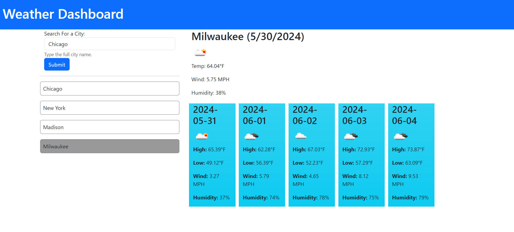

# Weather Dashboard

## Description

This project is a weather dashboard that runs in the browser and provides dynamically updated HTML and CSS. It utilizes the [OpenWeatherMap API](https://openweathermap.org/) to retrieve weather data for cities, displaying current and future weather conditions. User input is stored in localStorage to maintain a search history.

## API Reference

The project uses the [OpenWeatherMap API](https://openweathermap.org/) to fetch weather data.

## Usage

- Link to live application: [Weather Dashboard](https://tburzynski2.github.io/weather-dashboard/Develop/index.html)

To use this weather dashboard, simply open the `index.html` file in a web browser. Enter the name of a city in the search input, and press Enter or click the search button. The dashboard will display the current and future weather conditions for the specified city.

## Screenshots

## Dependencies

- This project requires an API key from OpenWeatherMap. Please register for an API key and replace the API URL with your own key.
- Internet connection is required to fetch weather data from the OpenWeatherMap API.

## License

This project is licensed under the MIT License. See the `LICENSE` file for details.
